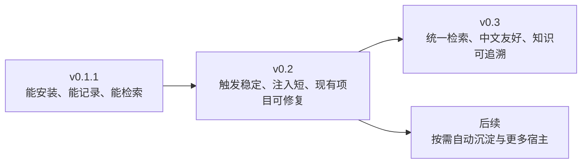
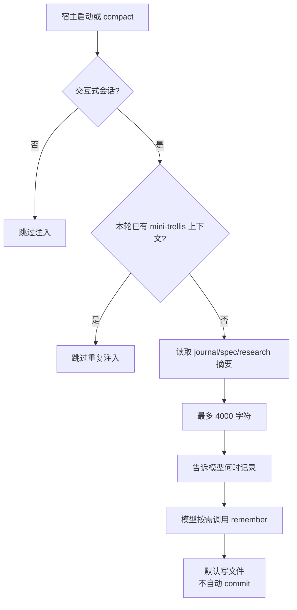

# mini-trellis 路线图

这份路线图从使用者的体验描述版本差异，并保留实现边界。v0.2 的目标是让四个宿主都能稳定触发、短注入、可诊断；v0.3 再把记忆检索统一起来。

## 版本体验

| 版本 | 用户看到的变化 | 主要工作 |
| --- | --- | --- |
| v0.1.1 | 四个宿主可以安装；用户主动 `remember`；SessionStart 能提供基础目录线索 | 保持 mini-trellis 的轻量内存层与 Trellis 迁移入口 |
| v0.2 | 新项目默认只写文件；已有 AGENTS、Claude/Codex/Pi 配置不会被覆盖；`doctor` 能告诉用户哪一端没接上；hook 不重复灌长文本 | 标记块合并、JSON 安全合并、四端诊断、注入预算、compact/重试去重、短触发规则 |
| v0.3 | 可以用一个入口搜索 journal、research 和对话；搜索结果说明来源和时间；旧结论不会悄悄覆盖新结论 | 统一索引、中文归一化、来源/状态/替代关系、按 spec 范围检索 |

## v0.2 触发与注入

触发规则用白话表达：

- 会话启动或 compact 后，宿主只注入当前状态摘要；详细内容按需读取。
- 用户确认了长期决策、研究得到可复用结论、会话即将结束，才记录。
- 普通讨论、临时尝试、每一轮回复都不需要记录。
- 新安装默认只写 journal/research 文件；只有显式配置或用户要求时才提交 Git。

## v0.2 借鉴与差异化

| 来源 | 继续借鉴 | mini-trellis 的取舍 |
| --- | --- | --- |
| Trellis 0.7 beta | SessionStart 注入、compact 后重新教学、宿主适配器、可迁移的脚本结构 | 去掉任务编排和长流程提示；只保留记忆层；注入摘要而不是整棵知识树 |
| Comet | 轻量命令入口、显式记录动作、简单的上下文组织 | 不引入复杂服务端状态；文件仍是第一真源 |
| Claude-mem | 对话沉淀与检索的产品方向 | v0.3 才统一索引；v0.2 先保证记录动作可靠 |
| QMD | 中文文本归一化和本地检索思路 | 作为 v0.3 的检索实现参考，避免现在提前引入重量依赖 |

